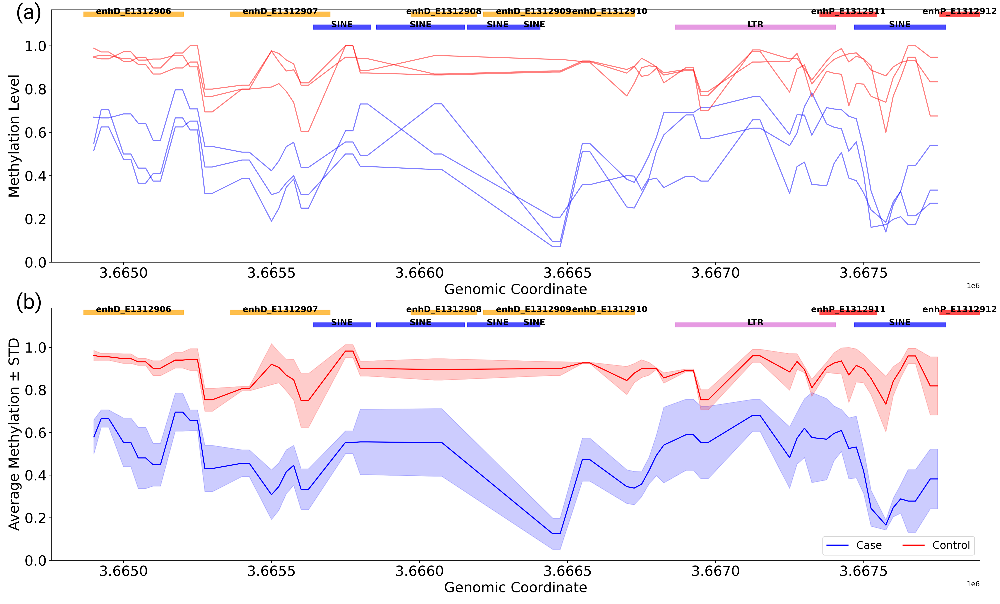
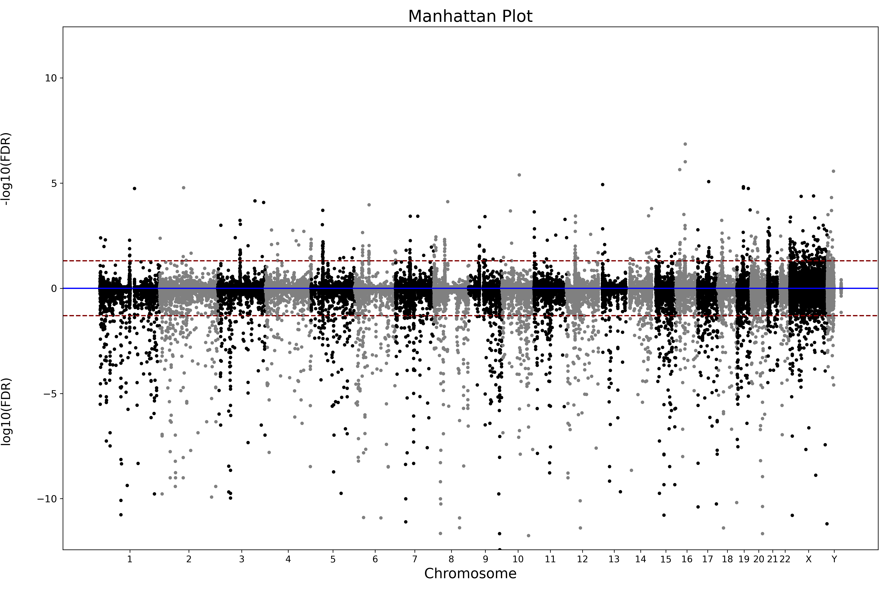

# Welcome to DiffMethylTools

**DiffMethylTools** is a comprehensive, command-line suite for DNA methylation analysis. It is designed to take you from raw alignment data to rich genomic annotations and publication-ready visualizations in minutes.

### Why DiffMethylTools?
- **Flexible Input:** Supports both BED and Bismark Cytosine Report (CR) formats natively, with options for fully custom column mapping.
- **Fast & Automated:** Run full pipelines from DMR (Differentially Methylated Regions) generation to annotation with a single command.
- **Rich Visualizations:** Automatically generate Volcano plots, Manhattan plots, region annotations, and methylation curves.

---

**Ready to begin?** Head over to the **[Installation](installation.md)** page to get set up!
